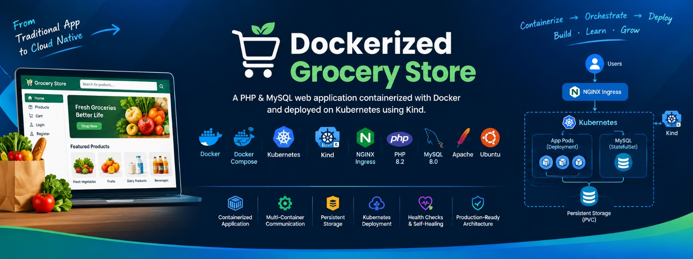
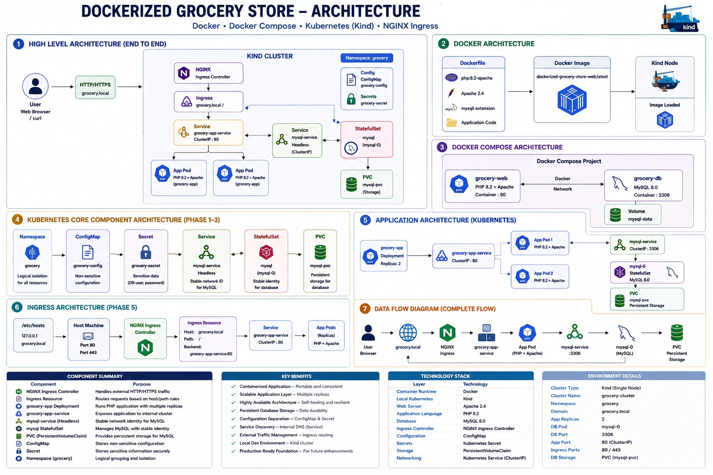
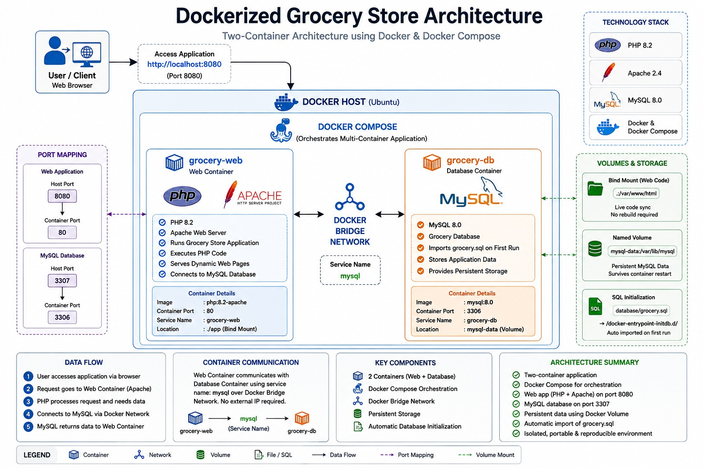
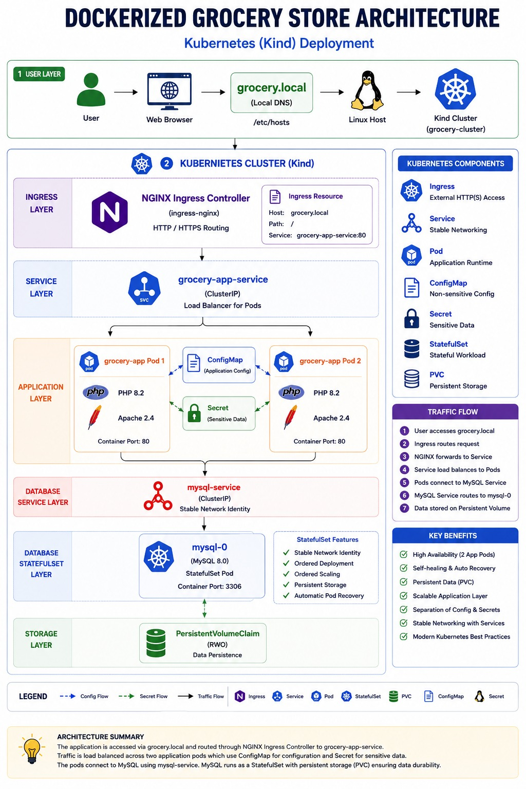

<p align="center">
  
</p>

<h1 align="center">🛒 Dockerized Grocery Store</h1>

<p align="center">
  A production-inspired PHP & MySQL web application containerized with Docker
  and deployed on Kubernetes using Kind.
</p>

<p align="center">


</p>

---

# 📖 About The Project

**Dockerized Grocery Store** is a PHP and MySQL based web application transformed into a containerized and Kubernetes-managed application.

The project started as a traditional PHP + MySQL application and was progressively modernized using Docker, Docker Compose, and Kubernetes.

Instead of manually installing and configuring PHP, Apache, MySQL, and their dependencies on the host system, the application runs inside isolated containers.

The project then extends the containerized application into a local Kubernetes environment using **Kind**, demonstrating application deployment, service discovery, persistent storage, health checks, Ingress routing, and Kubernetes self-healing.

The main objective is to gain practical experience with a realistic DevOps deployment workflow rather than simply running a web application locally.

---

# 🎯 Project Objectives

The project focuses on the following DevOps objectives:

- Containerize a traditional PHP and MySQL application
- Build a custom Docker image using a Dockerfile
- Run the application using Docker Compose
- Implement multi-container communication
- Configure persistent database storage
- Understand Docker networking and service discovery
- Migrate the containerized application to Kubernetes
- Create and manage a local Kubernetes cluster using Kind
- Deploy the application using Kubernetes Deployments
- Deploy MySQL using a StatefulSet
- Implement Kubernetes Services and EndpointSlices
- Separate configuration using ConfigMaps and Secrets
- Configure persistent storage using PVCs
- Expose the application using NGINX Ingress
- Implement application health checks
- Demonstrate Kubernetes self-healing
- Practice systematic troubleshooting
- Build a professional DevOps portfolio project

---

# 🏗️ Project Architecture

The project is implemented in multiple stages, progressing from local containerized development using Docker Compose to orchestrating highly-available workloads in Kubernetes using Kind.

<p align="center">
  
</p>

Detailed architecture diagrams and visual files are maintained in:

architecture/
├── system-architecture.png
├── docker-architecture.png
└── kubernetes-architecture.png

For a comprehensive explanation of components, see: [Architecture Documentation](docs/architecture.md)

---

## 🐳 Docker Architecture

The first deployment stage utilizes Docker Compose to run a multi-container environment with isolated bridge networks, bind mounts, and volume persistence.

<p align="center">
  
</p>

### Application Container
The web container runs:
- **PHP 8.2** runtime
- **Apache 2.4** web server
- Application source code mounted locally

### Database Container
The database container runs:
- **MySQL 8.0** engine
- Grocery Store database schema and initial data
- Persistent volume storage

### Docker Storage
- Application source code: `./app:/var/www/html`
- MySQL data: `mysql-data:/var/lib/mysql`

### Docker Port Mappings
| Host Port | Container Port | Service | Purpose |
| :--- | :--- | :--- | :--- |
| `8080` | `80` | `grocery-web` | Web Application Access |
| `3307` | `3306` | `grocery-db` | Direct MySQL Database Access |

---

## ☸️ Kubernetes Architecture

The containerized application is deployed into a local multi-node capable Kubernetes cluster created with **Kind**.

<p align="center">
  
</p>

### The Kubernetes deployment includes:
- **Kind Cluster & Namespace Isolation** (`grocery`)
- **ConfigMap & Secret Management** (Separation of app configs and DB credentials)
- **Application Deployment** (Multi-replica stateless PHP frontend pods)
- **StatefulSet Deployment** (Stateful MySQL database pod with stable identity)
- **Services & EndpointSlices** (`ClusterIP` services for internal networking)
- **PersistentVolumeClaim (PVC)** (Durable storage for database files)
- **Health Checks** (Liveness and Readiness Probes)
- **NGINX Ingress Controller** (HTTP reverse proxy and host-based routing)

---

# 🧰 Technology Stack

| Category | Technology |
| :--- | :--- |
| **Frontend** | HTML5, CSS3, JavaScript, Bootstrap |
| **Backend** | PHP 8.2 |
| **Web Server** | Apache 2.4 |
| **Database** | MySQL 8.0 |
| **Containerization** | Docker |
| **Container Orchestration** | Docker Compose / Kubernetes |
| **Local Kubernetes** | Kind |
| **Ingress Controller** | NGINX Ingress Controller |
| **Configuration** | ConfigMap |
| **Secret Management** | Kubernetes Secret |
| **Database Deployment** | StatefulSet |
| **Application Deployment** | Deployment |
| **Storage** | PersistentVolumeClaim (PVC) |
| **Networking** | Kubernetes Services / EndpointSlices |
| **Version Control** | Git / GitHub |
| **Operating System** | Ubuntu Linux |

---

# ✨ Key Features

### Application
- PHP-based Grocery Store e-commerce platform
- MySQL-backed database structure
- User authentication and dynamic product catalog
- Admin dashboard management functionality

### Docker
- Custom Dockerfile for PHP + Apache stack
- Multi-container orchestration via Docker Compose
- Isolated Docker bridge network
- Named volumes for database persistence
- Automatic SQL database initialization on container start

### Kubernetes
- Kind-based local cluster environment
- Dedicated `grocery` namespace isolation
- Multi-replica application deployment 
- StatefulSet for MySQL with PersistentVolumeClaim (PVC)
- Decoupled ConfigMaps and Secrets for security
- Internal Service Discovery via ClusterIP and EndpointSlices
- Readiness and Liveness health probes
- Resource requests and limits allocation
- Production-style NGINX Ingress routing

### Reliability & Operations
- Desired-state reconciliation and automatic pod self-healing
- Data persistence surviving pod and container destruction
- Automated deployment runbooks, validation checklists, and troubleshooting playbooks

---

# 📂 Repository Structure

```text
Dockerized-Grocery-Store/
│
├── app/
│   ├── admin/
│   │   ├── LICENSE
│   │   ├── README.md
│   │   ├── .travis.yml
│   │   ├── package.json
│   │   ├── package-lock.json
│   │   ├── vendor/
│   │   └── ...
│   ├── css/
│   ├── fonts/
│   ├── images/
│   ├── js/
│   ├── theme/
│   ├── index.php
│   ├── login.php
│   ├── logout.php
│   ├── products.php
│   ├── checkout.php
│   ├── payment.php
│   ├── dbcon.php
│   └── ...
│
├── database/
│   └── grocery.sql
│
├── k8s/
│   ├── namespace.yaml
│   ├── config/
│   ├── database/
│   ├── app/
│   └── ingress/
│
├── architecture/
│   ├── banner.png
│   ├── system-architecture.png
│   ├── docker-architecture.png
│   └── kubernetes-architecture.png
│
├── docs/
│   ├── architecture.md
│   ├── deployment-runbook.md
│   ├── troubleshooting.md
│   └── validation-checklist.md
│
├── screenshots/
│   ├── application.png
│   ├── cluster.png
│   ├── database.png
│   ├── deployment-success.png
│   ├── docker-build.png
│   ├── docker-compose.png
│   ├── ingress.png
│   ├── pods.png
│   ├── self-healing.png
│   ├── service.png
│   └── storage.png
│
├── Dockerfile
├── docker-compose.yml
├── kind-config.yaml
├── grocery-backup.sql
├── README.md
├── LICENSE
└── .gitignore
```
---

# 🚀 Getting Started

### Prerequisites
Ensure the following tools are installed on your workstation:

| Tool | Purpose |
| :--- | :--- |
| **Docker** | Containerization engine |
| **Docker Compose** | Multi-container setup tool |
| **kubectl** | Kubernetes command-line tool |
| **Kind** | Local Kubernetes cluster runner |
| **Git** | Source version control |

Verify installation versions:
docker --version
docker compose version
kubectl version --client
kind version
git --version

### 📥 Clone the Repository

git clone https://github.com/Shivam-Infra-Labs/Dockerized-grocery-store.git
cd Dockerized-grocery-store

---

# 🐳 Docker Compose Deployment

Docker Compose runs the application in isolated containers locally before pushing to Kubernetes.

### Build the Application Image
docker compose build

Verify the image creation:
docker images

### Start the Multi-Container Stack
docker compose up -d

Verify running containers:
docker compose ps

Expected running containers:
- `grocery-web`
- `grocery-db`

### Access the Application
Open your browser and navigate to:
http://localhost:8080

---

# 🗄️ Database Initialization & Storage

The MySQL database automatically imports the application schema during initial container spin-up.

- SQL Initialization path: `database/grocery.sql` -> `/docker-entrypoint-initdb.d/grocery.sql`
- Named Volume Mapping: `mysql-data:/var/lib/mysql`

> ⚠️ **Note:** To retain persistent database records, do not use `docker compose down -v` unless you intend to completely reset the database storage.

---

# ☸️ Kubernetes Deployment

### 1. Create the Kind Cluster
kind create cluster \
  --name grocery-cluster \
  --config kind-config.yaml

Verify cluster node state:
kubectl get nodes

*Expected Output:* `grocery-cluster-control-plane Ready`

### 📦 2. Load Local Docker Image into Kind Cluster
Load your locally built image into the Kind cluster nodes:
kind load docker-image dockerized-grocery-store-web:latest \
  --name grocery-cluster

### 📁 3. Create Namespace & Apply Configurations
kubectl apply -f k8s/namespace.yaml
kubectl apply -f k8s/config/

Verify namespace, ConfigMap, and Secret:
kubectl get namespace grocery
kubectl get configmap -n grocery
kubectl get secret -n grocery

### 🗄️ 4. Deploy Database Layer (MySQL StatefulSet)
kubectl apply -f k8s/database/

Verify StatefulSet and storage status:
kubectl get statefulset -n grocery
kubectl get pods -n grocery
kubectl get pvc -n grocery

*Expected Pod Output:* `mysql-0 1/1 Running`

### 🚀 5. Deploy Application Layer
Apply the application Deployment and Service manifests:
kubectl apply -f k8s/app/

Verify application pods and service:
kubectl get deployment -n grocery
kubectl get pods -n grocery
kubectl get svc -n grocery

### 🌐 6. Install NGINX Ingress Controller & Apply Ingress
Deploy NGINX Ingress Controller configured for Kind:
kubectl apply -f https://raw.githubusercontent.com/kubernetes/ingress-nginx/main/deploy/static/provider/kind/deploy.yaml

Wait for the ingress controller to reach the Ready state:
kubectl wait \
  --namespace ingress-nginx \
  --for=condition=ready pod \
  --selector=app.kubernetes.io/component=controller \
  --timeout=120s

Apply the project Ingress rules:
kubectl apply -f k8s/ingress/ingress.yaml

Verify Ingress status:
kubectl get ingress -n grocery

### 🖥️ 7. Configure Local Hostname Resolution
Add the domain mapping entry to your system's hosts file:
127.0.0.1 grocery.local

- **Linux / macOS:** `/etc/hosts`
- **Windows:** `C:\Windows\System32\drivers\etc\hosts`

### 🌍 8. Access the Application
Open your web browser and visit:
http://grocery.local:8081

---

# 🔍 Kubernetes Validation Commands

Check all environment components in one go:

kubectl get nodes
kubectl get pods -n grocery
kubectl get deployments -n grocery
kubectl get statefulsets -n grocery
kubectl get svc -n grocery
kubectl get endpointslice -n grocery
kubectl get pvc -n grocery
kubectl get ingress -n grocery

---

# ❤️ Kubernetes Self-Healing

The application Deployment utilizes desired-state management to automatically heal failed or deleted pods.

1. List existing running application pods:
kubectl get pods -n grocery

2. Delete one of the application pods:
kubectl delete pod <APP-POD-NAME> -n grocery

3. Watch Kubernetes instantly spawn a replacement pod:
kubectl get pods -n grocery -w

Kubernetes reconciles the cluster state to keep the replica count matching the desired configuration.

---

# 🩺 Health Checks & Service Discovery

- **Readiness Probes:** Verify that the web container is fully initialized and ready to handle incoming traffic before adding it to Service EndpointSlices.
- **Liveness Probes:** Continuously monitor container health, automatically restarting pods if the PHP application stops responding.
- **Service Discovery:** Web pods communicate with the database via the internal DNS service name `mysql-service` rather than hardcoded IP addresses.

---

# 🧪 Troubleshooting Methodology

This project follows a systematic layer-by-layer troubleshooting process:

Pod -> Container -> Deployment -> Service -> EndpointSlice -> Ingress -> NGINX Controller -> Host / Port

### Common Issues Addressed:
- **`CrashLoopBackOff` / `ImagePullBackOff`:** Image missing in Kind cluster or invalid startup command.
- **`Pending` PVC Status:** StorageClass mismatch or binding errors.
- **503 Service Temporarily Unavailable:** Ingress routing rules not properly matching backend Service port configurations.

Detailed troubleshooting procedures: [Troubleshooting Playbook](docs/troubleshooting.md)

---

# 📚 Documentation

Detailed technical documentation is available in the `docs/` directory:

| Document | Description |
| :--- | :--- |
| **[Architecture Documentation](docs/architecture.md)** | Full architectural breakdown of Docker & Kubernetes layers |
| **[Deployment Runbook](docs/deployment-runbook.md)** | Step-by-step operations guide for cluster deployment |
| **[Validation Checklist](docs/validation-checklist.md)** | Detailed criteria for cluster health and acceptance testing |
| **[Troubleshooting Playbook](docs/troubleshooting.md)** | Structured guide for resolving common Kubernetes errors |

---

# 📸 Screenshots

Implementation evidence and verification screenshots are placed in `screenshots/`:

- Docker build & Compose execution steps
- Kind cluster initialization & pod status
- StatefulSet & PVC persistent volume bindings
- Services, EndpointSlices, and NGINX Ingress rules
- Application interface rendering & self-healing tests

---

# 🔐 Security Considerations

- Environment credentials and passwords are moved out of code into Kubernetes Secrets.
- Non-sensitive operational configurations are stored in ConfigMaps.
- `.env` files and sensitive secrets are explicitly excluded using `.gitignore`.
- Database ports (`3306`) are kept internal to the Kubernetes network.

---

# 📊 Validation Summary

| Layer | Validation Status |
| :--- | :---: |
| **Application Layer** | ✅ |
| **Docker Image Build** | ✅ |
| **Docker Compose Orchestration** | ✅ |
| **MySQL Database Persistence** | ✅ |
| **Kind Cluster Deployment** | ✅ |
| **Kubernetes Deployments & Replicas** | ✅ |
| **StatefulSet & PVC Bindings** | ✅ |
| **Service Discovery & EndpointSlices** | ✅ |
| **ConfigMaps & Secrets Separation** | ✅ |
| **Liveness & Readiness Health Probes** | ✅ |
| **NGINX Ingress Routing** | ✅ |
| **Kubernetes Self-Healing Verification** | ✅ |
| **Troubleshooting Playbook & Documentation** | ✅ |

Complete verification steps: [Validation Checklist](docs/validation-checklist.md)

---

# 🚧 Future Improvements

- **CI/CD Integration:** Automate Docker builds, testing, and deployments using GitHub Actions or Jenkins.
- **Container Hardening:** Implement non-root user execution, multi-stage Docker builds, and Trivy vulnerability scanning.
- **Autoscaling & Monitoring:** Add Horizontal Pod Autoscaler (HPA), Prometheus, Grafana dashboards, and Loki log management.
- **Cloud Infrastructure:** Provision cloud-managed Kubernetes (AWS EKS / Azure AKS) using Terraform IaC scripts.

---

# 🎓 Learning Outcomes

This project demonstrates practical skills in:
- Containerizing legacy web applications
- Orchestrating multi-container environments using Docker Compose
- Managing persistent storage for stateful applications in Kubernetes
- Setting up ingress controllers, DNS resolution, and service routing
- Implementing self-healing architectures and systematic DevOps troubleshooting

---

# 🤝 Contributing

Contributions are welcome!
1. Fork the repository
2. Create a feature branch (`git checkout -b feature/enhancement`)
3. Commit changes (`git commit -m "Add new feature"`)
4. Push to branch (`git push origin feature/enhancement`)
5. Open a Pull Request

---

# 📜 License

This project is open-source under the [MIT License](LICENSE).

---

# 👨‍💻 Author

**Shivam Kumar Sinha**  
*DevOps | Cloud Computing | Linux | Networking | Docker | Kubernetes*

🌐 **Connect With Me:**
- 💼 **LinkedIn:** [Shivam Kumar Sinha](https://www.linkedin.com/in/shivam-kumar-sinha-0a9248308/)
- 💻 **GitHub:** [Shivam-Infra-Labs](https://github.com/Shivam-Infra-Labs)

---
## ⚙️ Configuration

This project uses placeholder values and demo credentials for
local development and demonstration.

Before running the project locally, review and replace the
placeholder values in the following files:

- `docker-compose.yml`
- `k8s/config/secret.yaml`

The following SQL files contain demo application data and
credentials used for local development and demonstration:

- `database/grocery.sql`
- `grocery-backup.sql`

> ⚠️ Never commit real passwords, tokens, or other sensitive
> credentials to Git.

<div align="center">
  Made with ❤️ by <b>Shivam Kumar Sinha</b>
</div>
